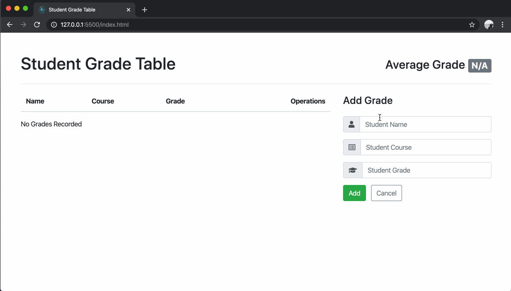

# student-grade-table-instructions

Instructions for building an interactive JavaScript application that communicates with a server to manage grade records.

## Introduction

For this project, you will be building a single-page JavaScript application that communicates with a server to manipulate a collection of student grades.

You'll be using the following technologies in your implementation:

- HTML
- CSS
- JavaScript
- jQuery AJAX
- Bootstrap 4

## Getting Started

1. Do not clone or fork this instructions repository. Create a new repository on GitHub
    - named `student-grade-table`
    - with a description of: **An interactive JavaScript application that communicates with a server to manage grade records.**
    - Be sure make your repository **Public**.
    - Check the box to **Initialize this repository with a README**.
    - Do not add a `.gitignore` or a license.
    - Click the **Create repository** button.
1. Clone the repository into your local `lfz/` directory.
1. Bookmark [the Server API documentation](https://github.com/Learning-Fuze/sgt_api/blob/master/README.md). You'll be using this as a reference while writing your AJAX calls.
1. Get an access token by following the [Create new user](https://github.com/Learning-Fuze/sgt_api#create-new-user) section of the API documentation. **Don't lose your API Key!**

## Features

Every software application is made up of **features**. A feature is a capability that the application grants a user. When a developer completes a feature, the code is clean and the application has some new functionality that it didn't have before.

### Important!

Software should be delivered to users in a working, polished state. Even if the software does not have all of the final features included, the features that _are_ included should work correctly and appear to be "finished". There should be no "placeholder" buttons or UI elements that don't actually function yet.

### Application Features

Here are the [MVP](https://en.wikipedia.org/wiki/Minimum_viable_product) features of your `student-grade-table` application:

1. [User can view all grades.](features/01-user-can-view-all-grades.md)
1. [User can view the average grade.](features/02-user-can-view-the-average-grade.md)
1. [User can add a grade.](features/03-user-can-add-a-grade.md)
1. [User can delete a grade.](features/04-user-can-delete-a-grade.md)

When those are completed, you can move on to implementing some [stretch features.](features/05-stretch-features.md)

## The Server API

The server that your application will communicate with is documented [here](https://github.com/Learning-Fuze/sgt_api/blob/master/README.md). Be sure to refer to this documentation when you are writing your AJAX calls.

## Workflow

For each feature you will be repeating the following workflow:

1. checking out a new git branch
1. implementing the necessary changes
1. taking a screenshot or recording a GIF
1. committing
1. pushing
1. and opening a Pull Request that to merge your feature branch into `master`. **The Pull Request should include your screenshot or GIF.**
1. merging your Pull Request once an instructor approves it
1. checking out `master` locally
1. pulling from `origin master` to sync your local `master` with GitHub's `master`

Once a feature Pull Request is opened, **do no move on until you get your Pull Request approved** by an instructor.

## MVP Preview

  

