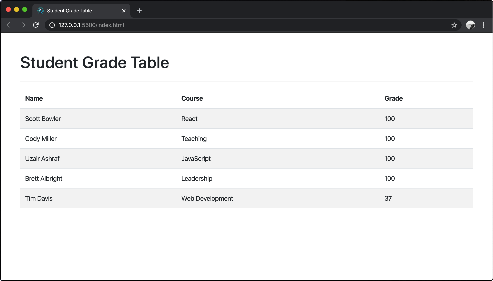

# User can view all grades.

## Before You Begin

Be sure to check out a new branch from your `master` branch. Your branch should be named `view-all-grades` because that is the feature you are implementing.

## 💰 Motivation

The IT department at a school has set up a database and server for managing student grades. Teachers at the school need a user-friendly way to view these grades.

## 🖼 Wireframe

<p align="middle">
  
</p>

## 👷‍♀ Implementation

**Make a commit after completing each of the following steps**. Your commit message should be a summary description of the code you wrote an why. For this feature, you will make about 15-20 commits.

#### Initial HTML

1. Did you remember to check out a new branch?
1. Since this is the first feature of the application, create a new `index.html`.
1. Link the `bootstrap.css` library to your HTML file. You can get the `<link>` tag [from cdnjs.com](https://cdnjs.com/libraries/twitter-bootstrap). **Be sure to use Bootstrap version 4**. You don't need the Bootstrap JavaScript library, just the CSS.
1. Add a header element to your `index.html` that contains the page title (Student Grade Table).
1. Add a table to `index.html` that looks like the example wireframe and [style it with Bootstrap](https://getbootstrap.com/docs/4.4/content/tables/). Hard-code three rows in your HTML table for the moment.
1. At this point, your HTML page should look like the wire frame.

#### Initial JavaScript Files

1. Add the jQuery library via a script tag to the **bottom** of the body in your `index.html`. You can get the `<script>` tag [from cdnjs.com](https://cdnjs.com/libraries/jquery). Use the `jquery.js` library rather than `core` or `slim`.
1. Create a new JavaScript file named `main.js` and add a script tag to the **bottom** of the body in your `index.html`, below the jQuery script tag.
1. Make a new directory named `components`. This will hold your various JavaScript components that control the DOM. Make a new JavaScript file at `components/app.js`. This will contain the primary component for your Student Grade Table application. Add a script tag for `components/app.js` just before your `main.js` script tag in `index.html`.
1. Verify that your JavaScript files are loading correctly by checking the **Network** tab of your browser's dev tools while refreshing the page.
1. Did you remember to commit every step?

#### Requesting Data

1. Within `components/app.js`, define a JavaScript class named `App`. This will be the primary class of your Student Grade Table application.
1. Define the following methods in your `App` class:
    - `handleGetGradesError` takes one parameter, `error`, and passes it to the [`error` method](https://developer.mozilla.org/en-US/docs/Web/API/Console/error) of the `console` object.
    - `handleGetGradesSuccess` takes one parameter, `grades`, and passes it to the [`log` method](https://developer.mozilla.org/en-US/docs/Web/API/Console/log) of the `console` object.
    - `constructor` takes no parameters for the moment, but should [`bind`](https://developer.mozilla.org/en-US/docs/Web/JavaScript/Reference/Global_objects/Function/bind) both `handleGetGradesError` and `handleGetGradesSuccess` to the `this` object.
    - `getGrades` takes no parameters, but in its code block, calls [jQuery's `ajax` method](https://api.jquery.com/jQuery.ajax/#jQuery-ajax-settings) to send a `GET` request to [the Student Grade Table API](https://github.com/Learning-Fuze/sgt_api#get-all-grades) to retrieve a list of grades. The `handleGetGradesError` and `handleGetGradesSuccess` methods should be used as the `error` and `success` callbacks in the ajax config object.
    - `start` takes no parameters, but in its code block calls the `getGrades` method of the `this` object.
1. In `main.js`, instantiate your `App` class and call the `start` method of the resulting object. Watch the **Console** and **Network** tabs of your browser's developer tools. You should see a request for the data in the **Network** tab and the received array of data in the **Console** tab.

#### Rendering the Grades

1. Delete the hard-coded table rows from your `index.html`, but leave the column headers so that it just looks like an empty table.
1. Create a new JavaScript file at `components/grade-table.js` and add a corresponding script tag to your `index.html` just before the script tag for `main.js`. Verify that your file is loading properly by looking at the **Network** tab of your browser's developer tools.
1. Within `components/grade-table.js`, define a class named `GradeTable` with the following methods:
    - `constructor` takes one parameter, `tableElement` and assigns it to the a property of the `this` object.
    - `updateGrades` takes one parameter, `grades` and logs it to the console for the time being.
1. Within `components/app.js`, add a `gradeTable` parameter to the `constructor`. The code block should assign `gradeTable` to a property of the `this` object.
1. Within `components/app.js`, modify the `handleGetGradesSuccess` method definition to pass its `grades` parameter to the `updateGrades()` method of the `gradeTable` property of the `this` object (instead of logging `grades` to the console).
    ```js
    this.gradeTable.updateGrades(grades)
    ```
1. Within `main.js` make the following modifications:
    - Before `App` is instantiated, query the document for your table element.
    - After you get the table element, but before instantiating `App`, instantiate `GradeTable`, passing in the table element.
    - Modify your instantiation of `App` to pass in your `GradeTable` instance as an argument.
1. Verify that your application still requests and logs the grade data without any errors before moving on.
1. Review the following DOM methods:
    - [`document.createElement()`](https://developer.mozilla.org/en-US/docs/Web/API/Document/createElement)
    - [`node.appendChild()`](https://developer.mozilla.org/en-US/docs/Web/API/Node/appendChild)
    - [`node.textContent`](https://developer.mozilla.org/en-US/docs/Web/API/Node/textContent)
1. Within `components/grade-table.js`, modify the definition of `GradeTable`'s `updateGrades` method to:
    - Empty the `<tbody>` of `this.tableElement`. You can find the `tbody` inside the `table` by [calling `this.tableElement`'s `querySelector` method](https://developer.mozilla.org/en-US/docs/Web/API/Element/querySelector).
    - Loop through the `grades` parameter and for each of them:
        - Create a new `<tr>` element that looks like this (use each grade object to set the real `textContent` of each `<td>`).
          ```html
          <tr>
            <td>Name of Student</td>
            <td>Name of Course</td>
            <td>Student's Grade</td>
          </tr>
          ```
        - Append the `<tr>` element to the `<tbody>` element.
1. Verify that your application requests and renders the grades it receives from the Student Grade Table API. Your app should now look like original wireframe again, once the grades render.
1. Did you remember to commit each step?

## ✅ Submitting Your Work

When this feature is complete, be sure to push all new commits to `origin view-all-grades`. Then open a Pull Request on your `student-grade-table` GitHub repository to merge `view-all-grades` into `master`.

Get an instructor to **Approve** your Pull Request before merging it into `master` and moving on to the next feature. **Be sure to include a screenshot or GIF of your app in the Pull Request comment.** After you get approval, merge your feature branch.

## 🏅 Feature Preview

<p align="middle">
  
</p>
