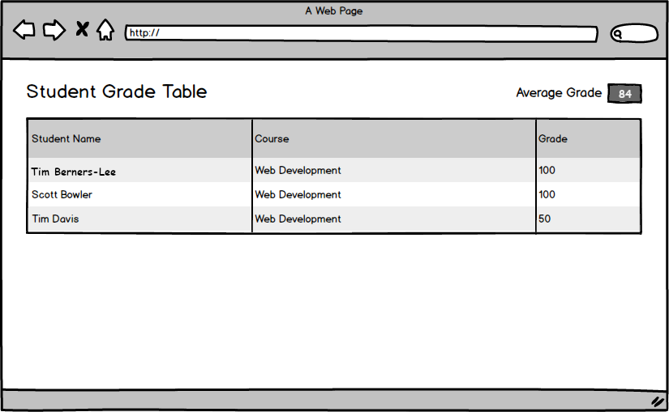
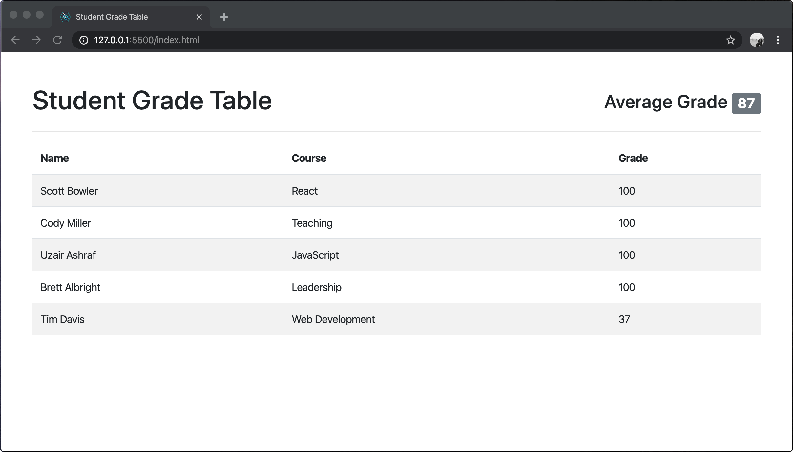

# User can view the average grade.

## Before You Begin

Be sure to check out a new branch from your `master` branch. Your branch should be named `view-average-grade` because that is the feature you are implementing.

## 💰 Motivation

Teachers at the school like to know how their students are performing in aggregate, so the app should compute the average grade for them.

## 🖼 Wireframe

  

## 👷‍♀ Implementation

**Make a commit after completing each of the following steps**. Your commit message should be a summary description of the code you wrote an why.

#### Modify the HTML

1. Read about Bootstrap's grid layout system [in the official Bootstrap documentation](https://getbootstrap.com/docs/4.4/layout/grid/).
1. Divide your `<header>` element in `index.html` using a two-column grid layout to show a hard-coded average grade as seen in the wireframe.
1. Style the average grade as a [Bootstrap badge](https://getbootstrap.com/docs/4.4/components/badge/). Take your time and try to match the layout of the wireframe.

#### Add a `PageHeader` Component

1. Create a new JavaScript file at `components/page-header.js` and add a script tag to `index.html` before the script tag for `main.js`.
1. Verify that your new file loads correctly.
1. Define a class in `components/page-header.js` named `PageHeader`. It should have the following methods:
    - `constructor` takes one parameter, `headerElement` and assigns it to a property of the `this` object.
    - `updateAverage` takes one parameter, `newAverage` and only logs the `newAverage` to the console for now.
1. Modify the `constructor` of your `App` component to receive a second parameter named `pageHeader` and assign it to a property of the `this` object.
1. Add the following to the beginning of `main.js` (before `App` is instantiated):
    - Query the document for your header element.
    - Instantiate your `PageHeader`, passing in the header element as an argument.
1. In `main.js` modify the instantiation of `App` to include your `PageHeader` instance as a second argument.
1. Verify that your code is still loading and displaying grades properly before moving on.
1. Did you remember to commit each step?

#### Dynamically Update the Average Grade

1. In `components/app.js`, modify your `handleGetGradesSuccess` method. It should do the following:
    - (It should already do this) Pass the received `grades` parameter to the `updateGrades` method of the `gradeTable` property of the `this` object.
    - Additionally, compute the numeric average of all grades received.
    - Finally, pass the computed average to the `updateAverage` method of the `pageHeader` property of the `this` object.
1. Verify that the average grade is logged to the console when your app loads the list of grades from the API.
1. Remove the hard-coded average grade from the average grade badge in `index.html`.
1. In `components/page-header.js`, modify the `updateAverage` method to:
    - Find the badge element within `this.headerElement` using [`element.querySelector()`](https://developer.mozilla.org/en-US/docs/Web/API/Element/querySelector)
    - Set the [`textContent`](https://developer.mozilla.org/en-US/docs/Web/API/Node/textContent) of the badge element to the value of the `newAverage` parameter.
1. Verify that the average is being correctly shown on the page when the application loads the grades.

## ✅ Submitting Your Work

When this feature is complete, be sure to push all new commits to `origin view-average-grade`. Then open a Pull Request on your `student-grade-table` GitHub repository to merge `view-average-grade` into `master`.

Get an instructor to **Approve** your Pull Request before merging it into `master` and moving on to the next feature. **Be sure to include a screenshot or GIF of your app in the Pull Request comment.** After you get approval, merge your feature branch.

## 🏅 Feature Preview

  

