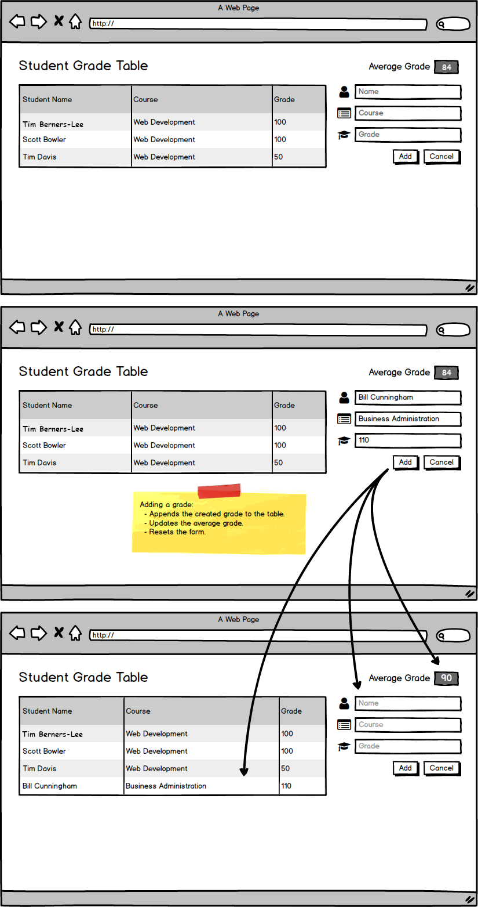
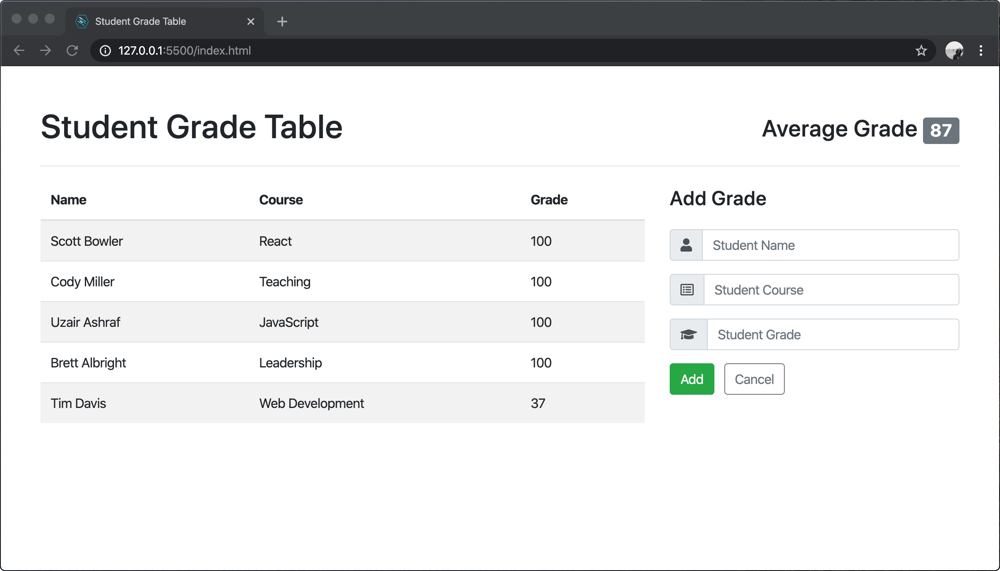

# User can add a grade.

## Before You Begin

Be sure to check out a new branch from your `master` branch. Your branch should be named `add-a-grade` because that is the feature you are implementing.

## 💰 Motivation

Teachers at the school would like to record new student grades without having to give them to the database administrator. If they want to start over, teachers should be able to easily reset the form with a button.

## 🖼 Wireframe

  

## 👷‍♀ Implementation

**Make a commit after completing each of the following steps**. Your commit message should be a summary description of the code you wrote an why.

#### Modify the HTML

1. Did you remember to check out a branch for this feature?
1. Add a `<link>` to the Font Awesome CSS icon library to your HTML file. You can get the `<link>` tag [from cdnjs.com](https://cdnjs.com/libraries/font-awesome). **Be sure to use the `all.min.css` library**. You don't need the image, font, or js libraries.
1. Read about styling [buttons](https://getbootstrap.com/docs/4.4/components/buttons/) and [forms](https://getbootstrap.com/docs/4.4/components/forms/) in the official Bootstrap documentation.
1. Wrap your HTML table element in a two-column grid layout using Bootstrap's [grid classes](https://getbootstrap.com/docs/4.4/layout/grid/) so that it appears in the left column.
1. Add an HTML form to the right column so that it matches the layout of the wireframe, including [input groups](https://getbootstrap.com/docs/4.4/components/input-group/) for the icons and [placeholder text](https://developer.mozilla.org/en-US/docs/Web/HTML/Element/input#htmlattrdefplaceholder). Give your buttons the [appropriate types](https://developer.mozilla.org/en-US/docs/Web/HTML/Element/button#attr-type). The **Add** button should be of `type="submit"` and the **Cancel** button should be of `type="reset"`.
1. Make sure that each of your `<input>` elements has a [`name` attribute](https://developer.mozilla.org/en-US/docs/Web/HTML/Element/input#htmlattrdefname), _e.i._ `"name"`, `"course"`, and `"grade"`.
1. Did you remember to commit each step?

#### Add a `GradeForm` Component

1. Create a new JavaScript file at `components/grade-form.js` and add a script tag to `index.html` before the script tag for `main.js`.
1. Verify that your new file loads correctly.
1. Within `components/grade-form.js`, define a new class named `GradeForm` and give it the following methods:
    - `constructor` takes one parameter, `formElement` and assigns it to a property of the `this` object.
    - `onSubmit` takes one parameter, `createGrade` and assigns it to a property of the `this` object.
    - `handleSubmit` takes one parameter, `event` and calls the [`preventDefault()`](https://developer.mozilla.org/en-US/docs/Web/API/Event/preventDefault) method on the `event` and logs a test message (like `"hi"`) to the console. That's all for now.
1. In `GradeForm`'s constructor, [`bind()`](https://developer.mozilla.org/en-US/docs/Web/JavaScript/Reference/Global_objects/Function/bind) `handleSubmit` before passing it as a [`'submit'` event](https://developer.mozilla.org/en-US/docs/Web/API/HTMLFormElement/submit_event) listener on `this.formElement`.
1. Within `components/app.js`, modify `App`'s constructor to take a third parameter, `gradeForm` and assign it to a property of the `this` object.
1. Add the following to the beginning of `main.js` (before `App` is instantiated):
    - Query the document for your form element.
    - Instantiate your `GradeForm`, passing in the form element as an argument.
1. In `main.js` modify the instantiation of `App` to include your `GradeForm` instance as a third argument.
1. Verify that your application still loads without any errors before moving on.

#### `POST` New Grades

1. Within `components/grade-form.js`, complete the implementation of the `handleSubmit` method as follows:
    - (It should already do this) Call the [`preventDefault()`](https://developer.mozilla.org/en-US/docs/Web/API/Event/preventDefault) method on the `event` parameter.
    - Instantiate a [`FormData()`](https://developer.mozilla.org/en-US/docs/Web/API/FormData/FormData) object, passing in the `target` property of the `event` object as an argument. `FormData` is global and already defined for you by the browser.
    - Use the [`get()`](https://developer.mozilla.org/en-US/docs/Web/API/FormData/get) method of your `FormData` instance to collect the `name`, `course`, and `grade` values into variables.
    - Call the `createGrade` method of the `this` object, passing your `name`, `course`, and `grade` variables as arguments.
    - Call [the `reset()` method](https://developer.mozilla.org/en-US/docs/Web/API/HTMLFormElement/reset) of the `target` property of the `event` object to reset the form.
1. Within `components/app.js`, add the following methods to your `App` class:
    - `createGrade`, takes a `name`, a `course`, and a `grade` and simply logs them to the console for now.
    - `handleCreateGradeError`, takes an `error` and passes it to the `error` method of the `console` object.
    - `handleCreateGradeSuccess`, calls the `getGrades()` method of the `this` object.
1. Bind `createGrade`, `handleCreateGradeError`, and `handleCreateGradeSuccess` in `App`'s constructor.
1. Modify `App`'s `start` method to also pass the `createGrade` property of the `this` object to the `onSubmit` method of the `gradeForm` property of the `this` object.
1. Verify that your application loads without any errors in the console.
1. Test your form. You should see the input values print to the console. You should see no errors and the page should not refresh.
1. Complete the implementation of `App`'s `createGrade` method to use [jQuery's `ajax()` method](https://api.jquery.com/jquery.ajax/#jQuery-ajax-settings) to send a `POST` request to [the Student Grade Table API](https://github.com/Learning-Fuze/sgt_api#create-new-grade). Include your `name`, `course`, and `grade` in the `data` being sent. The `handleCreateGradeError` and `handleCreateGradeSuccess` methods should be used as the `error` and `success` callbacks in the ajax config object.
1. Test your form again, you should see no errors in the console. Your table and average grade should update once the new grade is created and the list of grades is reloaded. The page should not refresh.
1. Did you remember to commit each step?

## ✅ Submitting Your Work

When this feature is complete, be sure to push all new commits to `origin add-a-grade`. Then open a Pull Request on your `student-grade-table` GitHub repository to merge `add-a-grade` into `master`.

Get an instructor to **Approve** your Pull Request before merging it into `master` and moving on to the next feature. **Be sure to include a screenshot or GIF of your app in the Pull Request comment.** After you get approval, merge your feature branch.

## 🏅 Feature Preview

  

