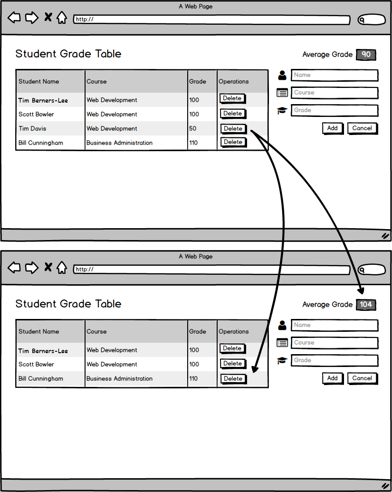

# User can delete a grade.

## Before You Begin

Be sure to check out a new branch from your `master` branch. Your branch should be named `delete-a-grade` because that is the feature you are implementing.

## 💰 Motivation

Teachers at the school would like to delete the grades of students that get kicked out of class. 👢

## 🖼 Wireframe

<p align="middle">
  
</p>

## 👷‍♀ Implementation

**Make a commit after completing each of the following steps**. Your commit message should be a summary description of the code you wrote an why.

#### Modify the HTML

1. Update your HTML table to include a column for **Operations**.
1. Add a hidden `<p>` element below your table that includes the text **No Grades Recorded**. Bootstrap has [`display` helper classes](https://getbootstrap.com/docs/4.4/utilities/display/#hiding-elements).

#### Enhance the `App` Component

1. Within `components/app.js`, add the following methods to the `App` class:
    - `deleteGrade` takes an `id` and simply logs it to the console for now.
    - `handleDeleteGradeError` takes an `error` and passes it to `console.error()`.
    - `handleDeleteGradeSuccess` takes no parameters and calls the `getGrades()` method of the `this` object.
1. Bind `deleteGrade`, `handleDeleteGradeError`, and `handleDeleteGradeSuccess` in `App`'s constructor.

#### Enhance the `GradeTable` Component

1. Add a method to `GradeTable` named `onDeleteClick` that accepts a parameter, `deleteGrade` and stores it as a property of the `this` object.
1. Define a new method in the `GradeTable` class named `renderGradeRow` that takes two parameters; `data` and `deleteGrade`. `data` will be a _single_ grade object and `deleteGrade` will be a function. `renderGradeRow` is responsible for the following:
    - creating a table row element like this, but with Bootstrap styling for the button
      ```html
      <tr>
        <td>Cassandra Cheung</td>
        <td>Career Counseling</td>
        <td>100</td>
        <td><button>DELETE</button></td>
      </tr>
      ```
    - populating the `<td>` elements with properties of the `data` object
    - adding a `'click'` event listener to the delete button element. The event listener's code block should pass `data.id` to the `deleteGrade` function
    - return the created table row element
1. Modify `GradeTable`'s `update` method to use `this.renderGradeRow` to create each row in a loop, passing in each grade object along with `this.deleteGrade` as a callback.
1. Modify `GradeTable`'s constructor to take a `noGradesElement` as a second parameter and store it as a property of the `this` object.
1. Modify `GradeTable`'s `update()` method to conditionally show or hide the `<p>` element indicating that there are no grades. It should be hidden if the `grades` parameter is not empty, otherwise shown.
1. In `main.js`, query the DOM for your `<p>` element (the one that says "No Grades Recorded") and pass it as a second argument to the `GradeTable` class when it's being instantiated.
1. Modify `App`'s `start` method to also pass `this.deleteGrade` into the `onDeleteClick` method of `this.gradeTable`.
1. Your page should load without errors and clicking the delete button for a specific grade should log its `id` to the console.

#### `DELETE` a Grade

1. Complete the implementation of `App`'s `deleteGrade` method to use [jQuery's `ajax()` method](https://api.jquery.com/jquery.ajax/#jQuery-ajax-settings) to send a `DELETE` request to [the Student Grade Table API](https://github.com/Learning-Fuze/sgt_api#delete-an-existing-grade). The `id` being passed to `deleteGrade` will be a grade id, and should be appended to the path of the request URL. The `handleDeleteGradeError` and `handleDeleteGradeSuccess` methods should be used as the `error` and `success` callbacks in the ajax config object.
1. Test your application:
    - You should see the delete requests in the **Network** tab of your developer tools when clicking delete buttons.
    - You should see no errors in the console when clicking delete buttons in your table rows.
    - Refreshing the page should not load any previously deleted grades.
    - If you delete all of your grades, the **No Grades Recorded** message should appear.

## ✅ Submitting Your Work

When this feature is complete, be sure to push all new commits to `origin delete-a-grade`. Then open a Pull Request on your `student-grade-table` GitHub repository to merge `delete-a-grade` into `master`.

Get an instructor to **Approve** your Pull Request before merging it into `master` and moving on to the next feature. **Be sure to include a screenshot or GIF of your app in the Pull Request comment.** After you get approval, merge your feature branch.

## 🏅 Feature Preview

<p align="middle">
  
</p>
