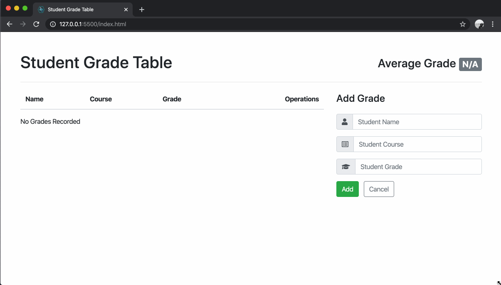
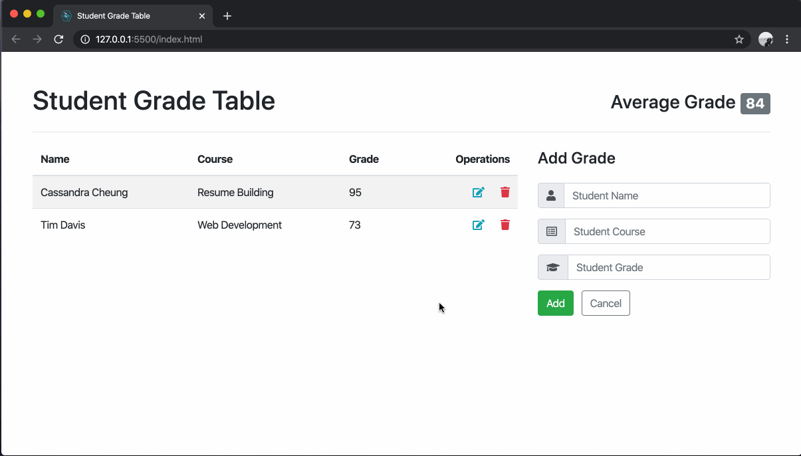

# Stretch Features

Now that you have completed the Minimum Viable Product features of the Student Grade Table, you can implement additional "stretch" features.

It is **critical** that the same development methodology be followed when implementing these features, even though the instructions have not bee supplied to you.

- Each feature should be developed on its own branch.
- Commit often to create a history of the implementation that another developer can follow.
- Get your Pull Request approved before moving on to the next feature.

It is recommended that you attempt these additional features, in this order.

## Feature - User can use the application on a mobile device.

💰 Teachers want to use the application from a mobile device, such as a tablet or smart phone. This means making the application responsive.

  

## Feature - User can update a grade.

💰 Teachers want to update a grade without having to delete and re-add them.

Review [the API documentation](https://github.com/Learning-Fuze/sgt_api#update-an-existing-grade) to see how to update a grade on the API server.

  

## Performance - Improve Network Efficiency

💰 The school has not been allocated fast WiFi, so avoid making an extra `GET` request to the API server after a successful create, update, or delete. Instead, cache the loaded grades in a property of the `App` instance. On success of an `ajax()` call, simply modify the cached grades array before updating the table and average.

Review [the API documentation](https://github.com/Learning-Fuze/sgt_api) to see how the server responds to `POST`, `PATCH`, and `DELETE` requests.
